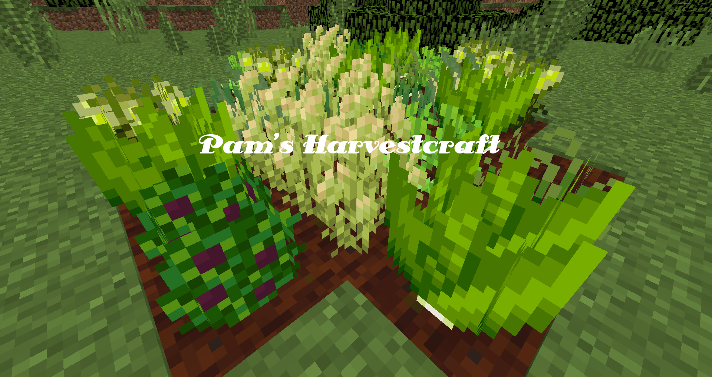

# 你现在是一个真正的农民了！

潘马斯农场有超过50种新水果和蔬菜。实际上，可能不止这些。

但是，这些水果和蔬菜中有多少是有用的？好吧，所有的都有用！

Each new food item has multiple different recipes it can belong to. Depending on the recipe you're after, the crops you grow are entirely up to you!

However, there are a handful of ridiculously useful plants that will help you along the way in the early game, and even the late game.

We will go over them in this guide.
