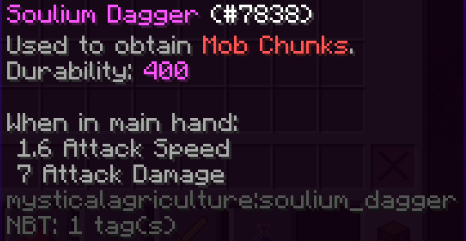
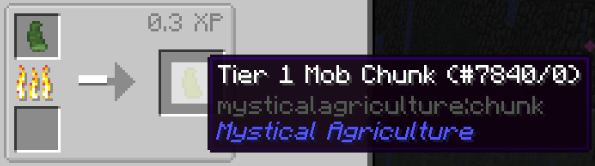
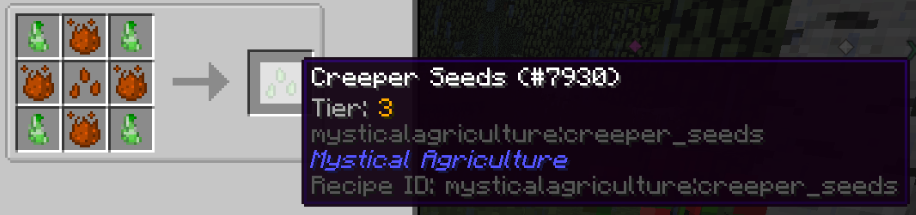

# 小匕首，大收获
___

灵魂匕首

你只能通过此物品获得怪物灵魂碎片。

使用该武器杀死生物，会有概率获得怪物灵魂碎片。灵魂碎片的类型取决于被杀死的生物。

第一步：制作灵魂锭。这是一个痛苦且套娃且不必要的过程。

获得石头（烧制过的圆石）和灵魂沙。

烧它。

获得下级精华并与下级灵魂沙合成。

烧制它。然后你就获得了制作灵魂匕首所需的灵魂锭!

但是等等，怎么没有刀柄!

你需要一些活化水晶碎片和一根木棍。

将以上所有东西组合起来，就能获得灵魂匕首!

现在你可以去击杀敌人，以获得怪物灵魂碎片!

灵魂碎片层级如下:

-僵尸是T只是1级怪物基础灵魂碎片。

-Farm animals come in at Tier 2.

-Overworld mobs at Tier 3.

-Most Nether mobs at Tier 4.

-Wither Skeletons at Tier 5.

You can cook Mob Chunks in order to receive the basic Mob Chunk at whatever tier the monster correlates to.

Here you can see, from a Zombie Mob Chunk, we receive a basic Tier 1 Mob Chunk.

With the basic chunk, we can craft it into seeds for other mobs. However, with Zombie being the only mob you can "grow" at Tier 1, this example is not so great.

In the case with a Tier 2 Mob Chunk, you could use the basic chunk to transition Sheep Chunks to Cow Chunks

Note: Each chunk also has its own special drop chance.

As you can see here, we are trying to make Creeper Seeds.
 
Take notice that Creeper Seeds require Intermedium Essence to be crafted.

Creeper Seeds are a Tier 3 seed and will require the third tier of essence to be crafted.

This goes for all seeds and their tiers, respectively.

